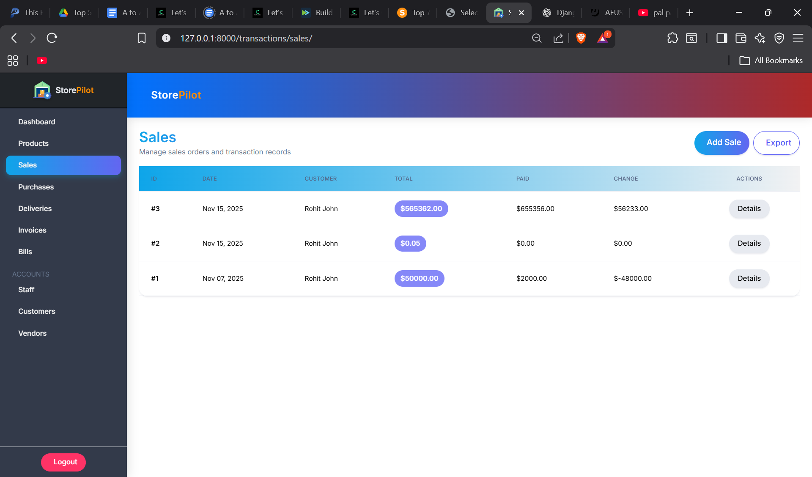
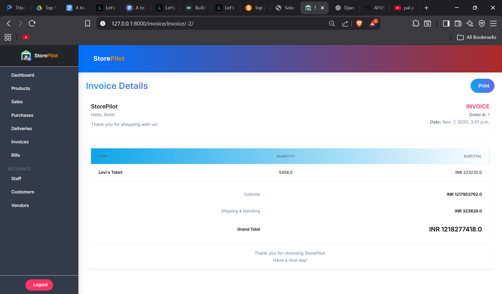

# 🧭 StorePilot – Sales & Inventory Management System  
**Built with Django, MySQL, Docker & Bootstrap 5**

A powerful full-stack **Sales & Inventory Management System** designed for small to medium businesses.  
StorePilot enables complete management of **products, sales, purchases, customers, staff, and billing** — all from an intuitive, modern UI.

---

## 📚 Table of Contents
- [📖 Description](#-description)
- [✨ Features](#-features)
- [🖼️ Screenshots](#-screenshots)
- [🛠️ Tech Stack](#-tech-stack)
- [📂 Project Structure](#-project-structure)
- [🚀 Installation Guide](#-installation-guide)
  - [🔧 1. Clone Repository](#-1-clone-repository)
  - [🐳 2. Run With Docker (Recommended)](#-2-run-with-docker-recommended)
  - [💻 3. Run Without Docker](#-3-run-without-docker)
- [🐬 MySQL Configuration](#-mysql-configuration)
- [📤 Deployment](#-deployment)
- [👨‍💻 Author](#-author)
- [📄 License](#-license)

---

## 📖 Description
**StorePilot** is a full-featured business management platform that streamlines day-to-day operations such as:
- Inventory and stock management  
- Dynamic sales processing (AJAX-powered)  
- Billing and invoice generation  
- Customer, vendor, and staff management  
- Real-time stock synchronization  
- Excel exporting and detailed reporting  
- Ready for production with Docker & MySQL support  

Perfect for **retail, wholesale, warehouse, and SMB** operations.

---

## ✨ Features

### 🛒 Sales Management
- Add items dynamically via AJAX  
- Auto tax, subtotal, and grand total calculation  
- Real-time stock deduction after each sale  
- Sales history and detailed views  
- Export sales to Excel

### 📦 Inventory Management
- Add, update, and delete products  
- Automatic stock adjustments  
- Category-wise listing and filtering  
- Low-stock alerts (optional)

### 🚚 Purchases & Vendors
- Record and manage purchase receipts  
- Stock auto-update on purchase  
- Vendor list management  
- Purchase and sales detail dashboards  

### 👥 Users
- Customer and staff management  
- Secure authentication via Django’s built-in auth system  

### 🧾 Billing & Invoices
- Auto-generated printable invoices  
- Customizable invoice templates  
- View past bills & download copies  

### 🎨 UI & UX
- Built with **Bootstrap 5**  
- Modern dark/gradient theme  
- Responsive design with smooth animations  

### 🧰 Miscellaneous
- Excel export via OpenPyXL  
- Pre-configured **Docker & Docker Compose**  
- MySQL-ready setup  
- Real-time AJAX endpoints  

---

## 🖼️ Screenshots

  
Click to expand

  
  
  
  
  
  

---

## 🛠️ Tech Stack

| Component | Technology |
|------------|-------------|
| **Backend** | Django 5, Python 3.11+ |
| **Frontend** | Bootstrap 5, HTML, JavaScript, AJAX |
| **Database** | MySQL (Production), SQLite (Development) |
| **Containerization** | Docker, Docker Compose |
| **Exporting** | OpenPyXL |
| **Auth** | Django Authentication |

---

## 📂 Project Structure
StorePilot/
│── accounts/ # Authentication & user management
│── bills/ # Billing logic
│── invoice/ # Invoice generation
│── store/ # Product & inventory logic
│── transactions/ # Sales & purchases
│── static/ # CSS, JS, images
│── Assets/ # Screenshots & media files
│── StorePilot/ # Core Django settings
│── Dockerfile
│── docker-compose.yml
│── requirements.txt
│── README.md
│── manage.py

---

## 🚀 Installation Guide

### 🔧 1. Clone Repository
### 🐳 2. Run With Docker (Recommended)

Build containers
docker-compose up --build -d

Apply migrations
docker exec -it storepilot-web python manage.py migrate

Create superuser
docker exec -it storepilot-web python manage.py createsuperuser

Access your app at:  
👉 [http://127.0.0.1:8000](http://127.0.0.1:8000)

---

### 💻 3. Run Without Docker

#### For Linux / macOS:
python3 -m venv venv
source venv/bin/activate
pip install -r requirements.txt
python manage.py migrate
python manage.py runserver

#### For Windows:
python -m venv venv
venv\Scripts\activate
pip install -r requirements.txt
python manage.py migrate
python manage.py runserver

---

## 🐬 MySQL Configuration

Create a `.env` file in the project root:
DB_NAME=storepilot
DB_USER=root
DB_PASSWORD=yourpassword
DB_HOST=db
DB_PORT=3306

Update `settings.py`:
DATABASES = {
'default': {
'ENGINE': 'django.db.backends.mysql',
'NAME': os.getenv("DB_NAME"),
'USER': os.getenv("DB_USER"),
'PASSWORD': os.getenv("DB_PASSWORD"),
'HOST': os.getenv("DB_HOST"),
'PORT': os.getenv("DB_PORT"),
'OPTIONS': {
'init_command': "SET sql_mode='STRICT_TRANS_TABLES'"
}
}
}

## 📤 Deployment

### Compatible Platforms
- Render  
- Railway  
- AWS / EC2  
- DigitalOcean  
- Docker VPS  

### Run With Gunicorn (Production)
gunicorn StorePilot.wsgi:application --bind 0.0.0.0:8000
---

## 👨‍💻 Author
Developed with passion by **[V4Viki](https://github.com/v4viki)**  
For contributions or issues, open a PR or report on GitHub.

---

## 📄 License
**MIT License** – free to use, modify, and share.

---

## 🎉 Thank You for Using StorePilot!
If you find this project helpful, give it a ⭐ on GitHub and share your feedback!
